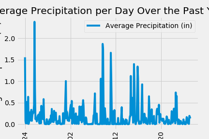
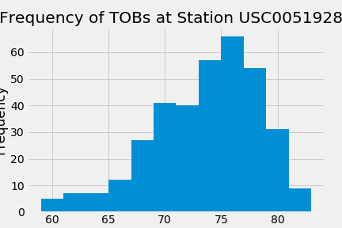
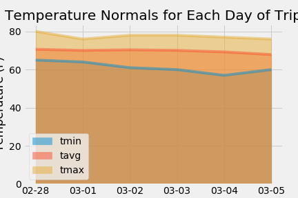
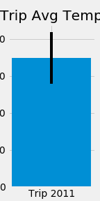

# SQLAlchemy Challenge


## Table of Contents
* [Objective](#Objective)
* [Technologies](#Technologies)
* [Process](#Process)
* [Visualization](#Visualization)

# Objective | Analyze Hawaii Climate for Optimal Vacation
Use Python and SQLAlchemy to do basic climate analysis and data exploration of your climate database.

# Technologies
* Python
* SQLAlchemy
* Pandas
* Matplotlib
* Flask

# Process

## Step 1 - Climate Analysis and Exploration

* Choose a start date and end date for your trip. Make sure that your vacation range is approximately 3-15 days total.

* Use SQLAlchemy `create_engine` to connect to your sqlite database.
```
engine = create_engine("sqlite:///Resources/hawaii.sqlite")
```

* Use SQLAlchemy `automap_base()` to reflect your tables into classes and save a reference to those classes called `Station` and `Measurement`.
```
# reflect an existing database into a new model
Base = automap_base()

# reflect the tables
Base.prepare(engine, reflect=True)
```

### Precipitation Analysis

* Design a query to retrieve the last 12 months of precipitation data, selecting only the `date` and `prcp` values.
```
precipitation = session.query(Measurements.date, func.avg(Measurements.prcp)).\
    group_by(Measurements.date).\
    order_by(Measurements.date.desc()).limit(365).all()
precipitation
```

* Load the query results into a Pandas DataFrame and set the index to the date column sorted by `date`.
```
precipitation_df = pd.DataFrame(precipitation, columns=['Date', 'Average Precipitation (in)'])
precipitation_df.set_index('Date', inplace=True, )
precipitation_df = precipitation_df.iloc[::-1]
precipitation_df
```

* Plot the results using the DataFrame `plot` method.
```
prcp_plot = precipitation_df.plot(rot=90, title= "Average Precipitation per Day Over the Past Year")
prcp_plot.set_ylabel("Average Precipitation (in)")
plt.savefig("Images/AvgPrecPerDay.png")
```

* Use Pandas to print the summary statistics for the precipitation data.
```
precipitation_df.describe()
```

### Station Analysis

* Design a query to calculate the total number of stations.
```
station_count = session.query(Measurements.station, func.count(Measurements.station)).\
    group_by(Measurements.station).all()

print("There are " + str(len(station_count)) + " stations in this dataset.")
```

* Design a query to find the most active stations.

  * List the stations and observation counts in descending order.
  ```
  active_stations = session.query(Measurements.station, func.count(Measurements.station)).\
    group_by(Measurements.station).\
    order_by(func.count(Measurements.station).desc()).all()
  active_stations
  ```

  * Which station has the highest number of observations?
  ```
  most_active_station = session.query(Measurements.station).\
    group_by(Measurements.station).\
    order_by(func.count(Measurements.station).desc()).first()
  most_active_station
  ```
  
* Design a query to retrieve the last 12 months of temperature observation data (TOBS).

  * Filter by the station with the highest number of observations.
  ```
  most_active_station_data = session.query(Measurements.station, func.min(Measurements.tobs), func.max(Measurements.tobs), func.avg(Measurements.tobs)).\
      filter(Measurements.station == most_active_station[0]).all()
      
  print("The lowest temperature recorded at station " + most_active_station_data[0][0] + " is " + str(most_active_station_data[0][1]) + " degrees.")
  print("The highest temperature recorded at station " + most_active_station_data[0][0] + " is " + str(most_active_station_data[0][2]) + " degrees.")
  print("The average temperature at station " + most_active_station_data[0][0] + " is " + str(round(most_active_station_data[0][3], 2)) + " degrees.")
  tob_12month = session.query(Measurements.date, Measurements.tobs).\
    filter(Measurements.station==most_active_station[0]).\
    filter(Measurements.date > '2016-08-18').\
    order_by(Measurements.date.desc()).all()
  tob_12month
  ```
  * Plot the results as a histogram with `bins=12`.
  ```
  plt.hist(tobs, bins=12)
  plt.xlabel("TOB")
  plt.ylabel("Frequency")
  plt.title("Frequency of TOBs at Station " +  most_active_station[0])
  plt.savefig("Images/FreqOfTOBs.png")
  plt.show()
  ```

- - -

## Step 2 - Climate App

Now that you have completed your initial analysis, design a Flask API based on the queries that you have just developed.

* Use Flask to create your routes.

### Routes

* `/`

  * Home page.

  * List all routes that are available.

* `/api/v1.0/precipitation`

  * Convert the query results to a dictionary using `date` as the key and `prcp` as the value.

  * Return the JSON representation of your dictionary.

* `/api/v1.0/stations`

  * Return a JSON list of stations from the dataset.

* `/api/v1.0/tobs`
  * Query the dates and temperature observations of the most active station for the last year of data.
  
  * Return a JSON list of temperature observations (TOBS) for the previous year.

* `/api/v1.0/<start>` and `/api/v1.0/<start>/<end>`

  * Return a JSON list of the minimum temperature, the average temperature, and the max temperature for a given start or start-end range.

  * When given the start only, calculate `TMIN`, `TAVG`, and `TMAX` for all dates greater than and equal to the start date.

  * When given the start and the end date, calculate the `TMIN`, `TAVG`, and `TMAX` for dates between the start and end date inclusive.

## Additional Analyses

### Temperature Analysis I

* Determine whether there is a meaningful difference between Hawaii's temperature in, for example, June and December?

* Identify the average temperature in June at all stations across all available years in the dataset. Do the same for December temperature.

* Use the t-test to determine whether the difference in the means, if any, is statistically significant. Will you use a paired t-test, or an unpaired t-test? Why?

### Temperature Analysis II

* Use the `calc_temps` function to calculate the min, avg, and max temperatures for your trip using the matching dates from the previous year (i.e., use "2017-01-01" if your trip start date was "2018-01-01").

* Plot the min, avg, and max temperature from your previous query as a bar chart.

  * Use the average temperature as the bar height.

  * Use the peak-to-peak (TMAX-TMIN) value as the y error bar (YERR).

    

### Daily Rainfall Average

* Calculate the rainfall per weather station using the previous year's matching dates.
```
trip_dates = ['2011-02-28', '2011-03-05']

trip_prcp = session.query(Measurements.station, func.sum(Measurements.prcp), Stations.latitude, Stations.longitude, Stations.elevation).\
    filter(Measurements.date >= trip_dates[0]).\
    filter(Measurements.date <= trip_dates[-1]).\
    filter(Measurements.station == Stations.station).\
    group_by(Measurements.station).\
    order_by(func.sum(Measurements.prcp).desc()).all()
trip_prcp
```

* Calculate the daily normals. Normals are the averages for the min, avg, and max temperatures.
```
def daily_normals(date):
    """Daily Normals.
    
    Args:
        date (str): A date string in the format '%m-%d'
        
    Returns:
        A list of tuples containing the daily normals, tmin, tavg, and tmax
    
    """
    
    sel = [func.min(Measurements.tobs), func.avg(Measurements.tobs), func.max(Measurements.tobs)]
    return session.query(*sel).filter(func.strftime("%m-%d", Measurements.date) == date).all()
    
daily_normals("01-01")
```

* Create a list of dates for your trip in the format `%m-%d`. Use the `daily_normals` function to calculate the normals for each date string and append the results to a list.
```
trip_days = ["02-28", "03-01", "03-02", "03-03", "03-04", "03-05"]
normals = [daily_normals(date)[0] for date in trip_days]
normals
```

* Load the list of daily normals into a Pandas DataFrame and set the index equal to the date.
```
normals_df = pd.DataFrame(normals, columns=["tmin", "tavg", "tmax"], index = trip_days)
normals_df
```

* Use Pandas to plot an area plot (`stacked=False`) for the daily normals.
```
area_plot = normals_df.plot.area(stacked=False, title="Temperature Normals for Each Day of Trip")
area_plot.set_xlabel("Date")
area_plot.set_ylabel("Temperature (F)")
plt.savefig("Images/TempNormEaDay.png")
```

# Visualization
* Average Precipitation Per Day

  

* Frequency of TOB's

  

* Temperture Norms Each Day

  

* Trip Average Temperatures

  
